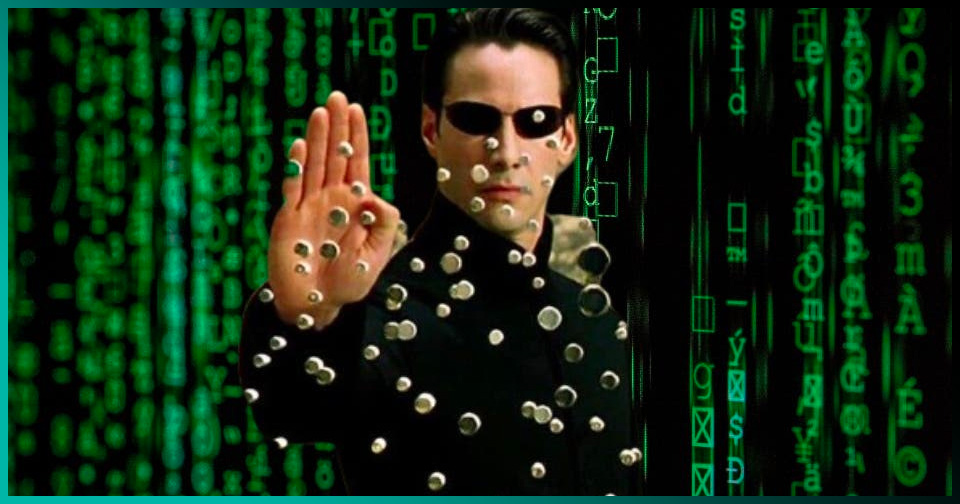
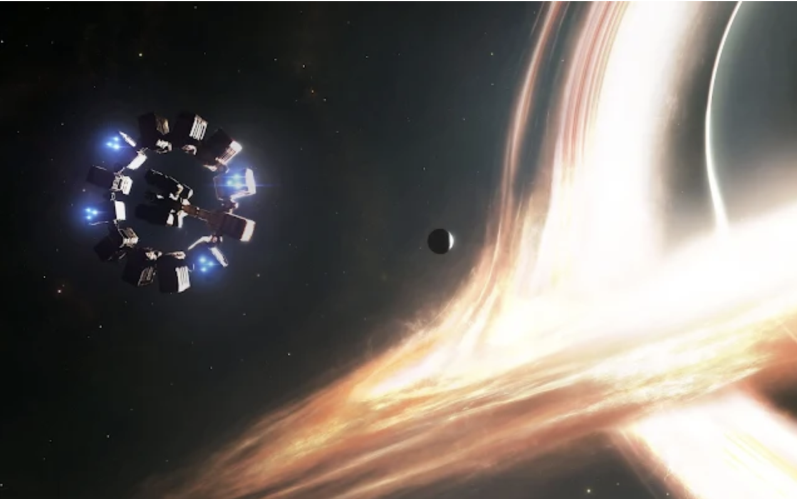
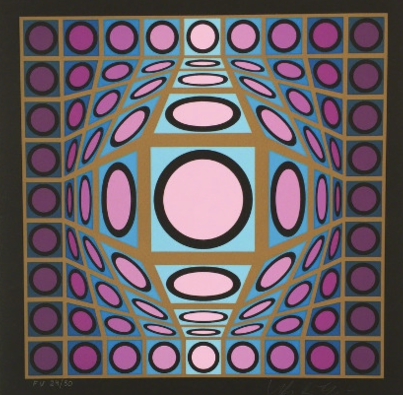
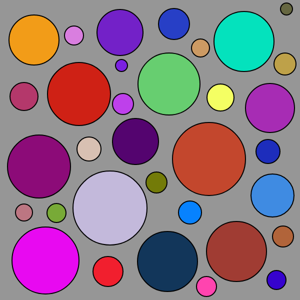
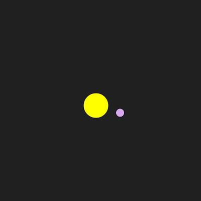

# yshe9095_9103_tut7
## Creative Coding Major Project
### Part1: Imaging Technique Inspiration
In our major project, we've chosen the artwork from Anwar Jalal Shemza, "Apple Tree." I was inspired by the fusion of digital and geometric art as depicted in films and visual art. For example, the  digital rain in "The Matrix" and the astral motion in "Interstellar". I would like to add these animation effects to our project. Additionally, the structured beauty in Victor Vasarely's geometric art aligns with our project's nature, which is fundamentally rooted in geometric forms. Through the p5.js technology, our goal is to animate the apple tree in a manner that invites interaction and adds the same geometric arts.

### Part2: Coding Technique Exploration
To achieve the abstract and dynamic visual effects described in Part 1, we will make use of object-oriented programming (OOP) and array functions in p5.js. OOP will allow us to define classes for geometric shapes, providing each object with properties and behaviors that can be interacted with and animated on the canvas. For example, a class might represent the orbiting planets depicted in "Interstellar." Array functions will be able to manage collections of these objects, facilitating operations such as creation, sorting and animation.  
**Check out some technique links.**  
[Array function](https://happycoding.io/tutorials/p5js/array-functions)  
  
[Popping Circles](https://happycoding.io/tutorials/p5js/creating-classes/popping-circles)  
  
[Planets](https://happycoding.io/tutorials/p5js/creating-classes/planets)  
  
